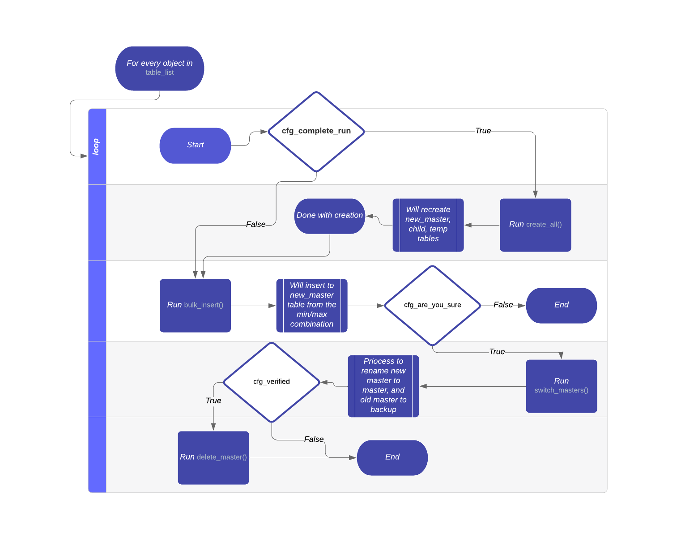

## WorkFlow Process
What happens when the [code](runner/run.py) is ran. 

It creates a new partitioned table of the previously giant un-partitioned one a monthly schema.  
This process reduces the stress in the production cost for inserts, select and deletes. 
This process reduces table bloating, although it might increase the overall index size, but with an advantage as the index would not be dealing with unbalance Btree. 
Once the table is partitioned, the instance will then needs to have a manual snapshot. 
This snapshot will be the historical rds which can be restored to get the data for point in time. 
Furthermore the current rds being partitioned can get rid of historical data by issuing drop commands to the child table, without impacting any process and resource

## Flow

## How to use
There are six variables that needs to be filled before execution in the [conf](runner/conf.py)

#### 1. database_connection_string
A dictionary that contains 5 keys, and defines the connection parameter.

1. <i>host</i> : The connection endpoint for the rds.
1. <i>port</i> : The port number.
1. <i>user</i> : The user with the priviledge to select/insert/delete/alter on the tables.
1. <i>passw</i> : The password.
1. <i>database</i> : The working database.

#### 2.table_list
A list of dictionaries where each dictionary should contains 9 keys, and is responsible for the archival of table.
<b>Each individual dictionary is reposible for the audit of one table only.</b>

1. <i>table_name</i> : Defines the name of the table to be archived
2. <i>temp_table_name</i> : The intermediate table created by the process for the archival to happen
3. <i>new_table_name</i> : Placeholder name of the table where the partitioned data will be placed.
4. <i>backup_table_name</i> : Name for when the original table will be stored as a backup.
5. <i>short_hand_name_for_child</i> : Prefix for the child tables for the new partitioned table
6. <i>id</i> : Primary column name of the table, should be int, and auto-incremental
7. <i>date_column_name</i> : The comma separated column(s) for table partitioning in a monthly manner
8. <i>new_date_column_name</i> : Combined column of preference, eg. coalesce(<i>date_column_name</i>)
9. <i>all_columns</i> : A dictionary containing all the columns as key and datatype as value, excluding primary.

#### 3. cfg_complete_run
A Boolean that when set to true will start from the very beginning of the process. It will recreate new master, child, and temp table. Will attempt to insert in new_master from the index 0. 
Else, if it is false, the process will pick up from where it stopped/halted the last time by comparing the index in the new master and old master, and will puch the difference only from the max of index 

#### 4. cfg_are_you_sure
A boolean when set to true will attempt to replace the new master table with the old master table, this switcheroo will take place by 
1. Locking the old master.
2. Renaming the old master to backup.
3. Renaming the new master to master.
4. Create function for new insert.
5. Create trigger for every new row insert calling the function
6. Changing sequence to current max+1.
7. Commit.

Else, will just print out the alter statements.

#### 5. cfg_verified
A Boolean parameter required after the rename. 
When set to True will attempt to drop the old master, currently named as backup. 
Dev input: Better to keep it False.

#### 6. cfg_divisor
An integer that defines that for each run how many row should be considered. 
Should be a multiple of 10, prefered 1000000 